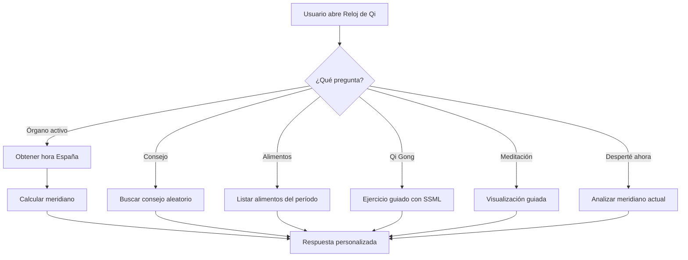

# ☯️ Reloj de Qi - Alexa Skill

<div align="center">


[](https://www.amazon.com/dp/XXXXX)
[](https://nodejs.org/)
[](LICENSE)
[](https://github.com/JoseAlvarezDev)

**Tu guía personal del Reloj Orgánico de la Medicina Tradicional China**

[🎯 Características](#-características) •
[🕐 Los 12 Meridianos](#-los-12-meridianos) •
[🗣️ Comandos](#️-comandos-de-voz) •
[🚀 Instalación](#-instalación) •
[📄 Licencia](#-licencia)

</div>

---

## 📖 Descripción

**Reloj de Qi** es una skill de Alexa que te guía a través de los 12 períodos de 2 horas del día según la Medicina Tradicional China. Descubre qué órgano está más activo en cada momento, recibe consejos personalizados, practica Qi Gong y medita para armonizar tu energía vital.

> *"El Qi fluye donde la mente va. Dirige tu atención hacia la sanación."*

---

## ✨ Características

| Función | Descripción |
|---------|-------------|
| 🔮 **Consulta en tiempo real** | Descubre qué meridiano está activo ahora |
| 💡 **Consejos personalizados** | Recomendaciones específicas para cada período |
| 🍵 **Nutrición** | Alimentos recomendados según la hora |
| 🧘 **Qi Gong** | Ejercicios guiados para cada meridiano |
| 🧘‍♀️ **Meditación** | Visualizaciones guiadas con SSML |
| 😴 **Análisis de sueño** | Por qué despiertas a ciertas horas |
| 🌿 **5 Elementos** | Información sobre Madera, Fuego, Tierra, Metal y Agua |
| 🌍 **Zona horaria** | Configurado para España (Europe/Madrid) |

---

## 🕐 Los 12 Meridianos

<div align="center">

| Hora | Órgano | Elemento | Emoción |
|:----:|:------:|:--------:|:-------:|
| 03-05 | 🫁 Pulmón | Metal | Tristeza → Coraje |
| 05-07 | 🟤 Intestino Grueso | Metal | Apego → Liberación |
| 07-09 | 🍚 Estómago | Tierra | Preocupación → Empatía |
| 09-11 | 💛 Bazo | Tierra | Ansiedad → Concentración |
| 11-13 | ❤️ Corazón | Fuego | Excitación → Alegría |
| 13-15 | 🔴 Intestino Delgado | Fuego | Confusión → Claridad |
| 15-17 | 💧 Vejiga | Agua | Miedo → Sabiduría |
| 17-19 | 🫘 Riñón | Agua | Temor → Voluntad |
| 19-21 | 💜 Pericardio | Fuego | Vulnerabilidad → Protección |
| 21-23 | 🔥 Triple Calentador | Fuego | Desorden → Armonía |
| 23-01 | 💚 Vesícula Biliar | Madera | Ira → Decisión |
| 01-03 | 🟢 Hígado | Madera | Frustración → Amabilidad |

</div>

---

## 🗣️ Comandos de Voz

```
"Alexa, abre Reloj de Qi"
```

### Comandos disponibles:

| Comando | Función |
|---------|---------|
| *"¿Qué órgano está activo?"* | Meridiano actual con información detallada |
| *"Dame un consejo"* | Consejo personalizado para el momento |
| *"¿Qué debería comer?"* | Alimentos recomendados |
| *"Dame un ejercicio de Qi Gong"* | Práctica guiada de movimiento |
| *"Guíame en una meditación"* | Meditación con visualización |
| *"Me he despertado ahora"* | Análisis de por qué estás despierto |
| *"Me despierto a las 3am"* | Análisis de patrones de sueño |
| *"Cuéntame sobre el hígado"* | Información de un órgano específico |
| *"Dame una frase de sabiduría"* | Proverbio de medicina china |

---

## 📁 Estructura del Proyecto

```
reloj-de-qi/
├── 📂 lambda/
│   ├── 📄 index.js              # Código principal de la skill
│   ├── 📄 package.json          # Dependencias
│   └── 📂 data/
│       └── 📄 reloj-data.json   # Base de datos de meridianos
├── 📂 models/
│   └── 📄 es-ES.json            # Modelo de interacción (español)
├── 📂 assets/
│   ├── 🖼️ reloj-qi-108.png     # Icono pequeño
│   └── 🖼️ reloj-qi-512.png     # Icono grande
├── 📄 skill.json                # Manifest del skill
├── 📄 Privacy-Policy.html       # Política de privacidad
├── 📄 Terms-of-Use.html         # Términos de uso
├── 📄 legal-styles.css          # Estilos de páginas legales
└── 📄 README.md                 # Este archivo
```

---

## 🚀 Instalación

### Requisitos previos

- Cuenta de [Amazon Developer](https://developer.amazon.com/)
- Node.js 18.x o superior

### Pasos

1. **Clonar el repositorio**
   ```bash
   git clone https://github.com/JoseAlvarezDev/reloj-de-qi.git
   cd reloj-de-qi
   ```

2. **Instalar dependencias**
   ```bash
   cd lambda
   npm install
   ```

3. **Crear skill en Alexa Console**
   - Ve a [Alexa Developer Console](https://developer.amazon.com/alexa/console/ask)
   - Crea un nuevo skill "Custom" con "Alexa-hosted (Node.js)"
   - Copia el modelo de `models/es-ES.json` al JSON Editor
   - Copia los archivos de `lambda/` al editor de código

4. **Deploy**
   - Save → Build Model
   - Save → Deploy

---

## 🛠️ Tecnologías

<div align="center">


</div>

---

## 📊 Diagrama de Flujo



---

## 🤝 Contribuir

¡Las contribuciones son bienvenidas! Si tienes ideas para mejorar el skill:

1. Fork del repositorio
2. Crea una rama (`git checkout -b feature/nueva-funcionalidad`)
3. Commit de cambios (`git commit -m 'Añade nueva funcionalidad'`)
4. Push a la rama (`git push origin feature/nueva-funcionalidad`)
5. Abre un Pull Request

---

## 📄 Licencia

Este proyecto está bajo la Licencia MIT. Ver el archivo [LICENSE](LICENSE) para más detalles.

---

## 👨‍💻 Autor

<div align="center">

**Jose Alvarez Dev**

[](https://github.com/JoseAlvarezDev)

</div>

---

<div align="center">

**Que tu Qi fluya en armonía** 🙏

<sub>Hecho con ❤️ y ☯️ en España</sub>

</div>
